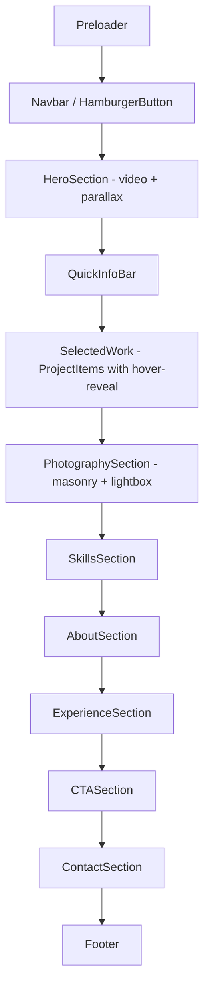

# Design Document: Awwwards Redesign, Photography & SEO

## Overview

This design transforms the existing Lufuno Damari portfolio into an award-worthy cinematic experience inspired by the Dennis Snellenberg / olivierlarose awwwards-landing-page aesthetic. The redesign covers three pillars:

1. **Visual & Interaction Overhaul** — Dark cinematic foundation, lerp-based cursor-following thumbnails on project items, enhanced scroll animations, and refined spacing/typography.
2. **Photography Section** — A new masonry-grid gallery with lightbox, positioned between Selected Work and Skills.
3. **SEO Enhancement** — JSON-LD structured data, Open Graph/Twitter Card meta, semantic heading hierarchy, and image optimisation for videography/cinematography/photography discoverability.

The existing tech stack remains unchanged: Next.js 16 (App Router), React 19, TypeScript, Tailwind CSS v4, Framer Motion 12, GSAP 3.15, and Locomotive Scroll 5. All new styling uses Tailwind CSS v4 utility classes exclusively.

---

## Architecture

### High-Level Page Flow



### Rendering Strategy

| Layer | Technology | Responsibility |
|-------|-----------|----------------|
| Layout (`app/layout.tsx`) | Next.js Server Component | SEO metadata export, JSON-LD `<script>`, Open Graph, fonts |
| Page (`app/page.tsx`) | Client Component (`"use client"`) | Locomotive Scroll init, preloader state, section composition |
| Sections | Client Components | Individual section rendering with AnimatedSection wrapper |
| Shared components | Mixed | Magnetic, RoundedButton, Lightbox — all client-side |

### Animation Ownership

| Animation Type | Library | Components |
|----------------|---------|------------|
| Smooth scroll + parallax | Locomotive Scroll 5 | Page-level, Hero video |
| Cursor-follow magnetic | GSAP `quickTo` | Magnetic component wrapper |
| Button fill timeline | GSAP timeline | RoundedButton |
| Nav scroll trigger | GSAP ScrollTrigger | Navbar → HamburgerButton transition |
| Hover-reveal thumbnail (lerp) | GSAP `quickTo` or `requestAnimationFrame` | ProjectItem cursor-following image |
| Mount/unmount transitions | Framer Motion | Preloader exit, SideMenu slide, Lightbox |
| Scroll-linked fade/translate | Framer Motion `useScroll`/`useTransform` | HeroSection parallax, ContactSection |
| In-view reveal | Framer Motion `whileInView` | AnimatedSection wrapper |

---

## Components and Interfaces

### New Components

#### 1. `components/ProjectItem.tsx` (replaces ProjectCard for awwwards list layout)

```typescript
interface ProjectItemProps {
  project: Project;
  index: number;
  onPlay: (videoUrl: string) => void;
}
```

**Behaviour:**
- Renders as a horizontal row: index number, title, role — separated by 1px border-bottom lines.
- On hover, reveals a floating thumbnail (300px wide, 16:9 aspect ratio) that follows the cursor with lerp smoothing (factor 0.1).
- Thumbnail scales from 0→1 on mouseenter (300ms ease-out) and 1→0 on mouseleave (300ms ease-in).
- Lerp tracking uses `requestAnimationFrame` with position state: `current += (target - current) * 0.1`.
- Thumbnail positioned offset +20px from cursor on both axes.
- Touch devices: thumbnail is not shown (detected via `pointer: coarse` media query).

#### 2. `sections/PhotographySection.tsx`

```typescript
interface PhotographySectionProps {
  // Data pulled from portfolioData.photographyItems
}
```

**Behaviour:**
- Masonry grid: 2 columns (< 768px), 2 columns (768–1023px), 3 columns (≥ 1024px).
- Uses CSS `columns` or `grid-template-rows: masonry` with fallback column-based approach.
- Each Gallery_Item: Next.js `<Image>` with lazy loading, hover scale(1.03) + brightness(110%) over 300ms.
- Click opens Lightbox with selected image index.

#### 3. `components/Lightbox.tsx`

```typescript
interface LightboxProps {
  images: PhotoItem[];
  activeIndex: number;
  onClose: () => void;
  onNavigate: (index: number) => void;
}
```

**Behaviour:**
- Full-screen overlay with semi-transparent backdrop (bg-black/90).
- Framer Motion AnimatePresence for enter/exit transitions.
- Left/right arrow navigation with keyboard support (ArrowLeft, ArrowRight, Escape).
- Wraps around: past last → first, before first → last.
- Close button top-right corner.
- Focus trapped within lightbox while open.
- Returns focus to triggering Gallery_Item on close.

#### 4. `components/JsonLd.tsx` (Server Component)

```typescript
interface JsonLdProps {
  data: Record<string, unknown>;
}
```

**Behaviour:**
- Renders a `<script type="application/ld+json">` tag with serialised JSON-LD.
- Used in `app/layout.tsx` for Person and CreativeWork schemas.

### Refactored Components

#### `components/SelectedWork.tsx` → Updated Layout

- Replaces grid of `ProjectCard` components with a vertical list of `ProjectItem` components.
- Section heading uses display typography (min 4vw desktop / 8vw mobile).
- Maintains VideoModal integration for play functionality.

#### `sections/AnimatedSection.tsx` → Enhanced

- Change `y: 20` → `y: 40` for more dramatic entrance.
- Change `duration: 0.5` → `duration: 0.6`.
- Change viewport margin `"-100px"` → use `amount: 0.2` threshold for 20% visibility trigger.
- Ensure `opacity: 0` pre-animation state remains accessible to screen readers (use `aria-hidden={false}` or rely on Framer Motion's style-only approach).

#### `components/layout/Navbar.tsx` → Branded for Lufuno

- Replace "Dennis Snellenberg" branding with Lufuno Damari copyright mark.
- Add "Photography" link to navigation items.
- Ensure hamburger button has `aria-label="Toggle menu"`.

#### `components/layout/SideMenu.tsx` → Updated Nav Items

- Add "Photography" to navItems array.
- Update social links to pull from `portfolioData.contact`.

#### `components/layout/Footer.tsx` → Multi-column + Data-driven

- Restructure to 3-column layout: copyright, nav links, social links.
- Pull social URLs from `portfolioData.contact` (add `linkedinUrl`, `facebookUrl`).
- Conditionally render social links (omit if URL is undefined/null).
- Dynamic year via `new Date().getFullYear()`.

#### `sections/HeroSection.tsx` → Typography Scale

- Heading to use `text-[8vw] lg:text-[4vw]` minimum sizing.
- Ensure single `<h1>` for SEO heading hierarchy.

---

## Data Models

### New: `PhotoItem` Interface

```typescript
export interface PhotoItem {
  id: string;
  title: string;
  category: "portrait" | "landscape" | "event" | "street" | "editorial";
  src: string;       // Path relative to public: "/images/{filename}.{ext}"
  alt: string;       // Descriptive, 5–125 characters
  width: number;     // 800–4000px
  height: number;    // 600–3000px
}
```

### Updated: `PortfolioData` Interface

```typescript
export interface PortfolioData {
  // ... existing fields unchanged ...
  photographyItems: PhotoItem[];
  contact: ContactInfo; // extended below
}
```

### Updated: `ContactInfo` Interface

```typescript
export interface ContactInfo {
  email: string;
  phone: string | null;
  instagramUrl: string;
  facebookUrl?: string;
  linkedinUrl?: string;
  location: string;
}
```

### Placeholder Photography Data (minimum 6 entries)

```typescript
export const portfolioData: PortfolioData = {
  // ... existing data ...
  photographyItems: [
    {
      id: "photo-1",
      title: "Golden Hour Portrait",
      category: "portrait",
      src: "/images/photo-portrait-1.jpg",
      alt: "Portrait of a woman in golden hour light with bokeh background",
      width: 1600,
      height: 2400,
    },
    {
      id: "photo-2",
      title: "Johannesburg Skyline",
      category: "landscape",
      src: "/images/photo-landscape-1.jpg",
      alt: "Johannesburg skyline at dusk with city lights emerging",
      width: 3200,
      height: 2000,
    },
    {
      id: "photo-3",
      title: "Music Festival Crowd",
      category: "event",
      src: "/images/photo-event-1.jpg",
      alt: "Crowd at an outdoor music festival with stage lighting",
      width: 2800,
      height: 1800,
    },
    {
      id: "photo-4",
      title: "Maboneng Alley",
      category: "street",
      src: "/images/photo-street-1.jpg",
      alt: "Pedestrians walking through a Maboneng alley with street art",
      width: 2000,
      height: 3000,
    },
    {
      id: "photo-5",
      title: "Fashion Editorial Shoot",
      category: "editorial",
      src: "/images/photo-editorial-1.jpg",
      alt: "Model posing in editorial fashion setup with dramatic lighting",
      width: 2400,
      height: 3200,
    },
    {
      id: "photo-6",
      title: "Corporate Event Keynote",
      category: "event",
      src: "/images/photo-event-2.jpg",
      alt: "Speaker on stage at corporate conference with audience silhouettes",
      width: 3000,
      height: 2000,
    },
  ],
};
```

### SEO Data Structures

**JSON-LD Person Schema:**
```json
{
  "@context": "https://schema.org",
  "@type": "Person",
  "name": "Lufuno Damari",
  "jobTitle": ["Videographer", "Cinematographer", "Photographer"],
  "url": "https://lufunodamari.com",
  "address": {
    "@type": "PostalAddress",
    "addressLocality": "Johannesburg",
    "addressCountry": "South Africa"
  },
  "sameAs": [
    "https://instagram.com/lufuno_damari",
    "https://www.facebook.com/lufuno.damari"
  ]
}
```

**JSON-LD CreativeWork Schema:**
```json
{
  "@context": "https://schema.org",
  "@type": "CreativeWork",
  "name": "Lufuno Damari Portfolio",
  "creator": {
    "@type": "Person",
    "name": "Lufuno Damari"
  },
  "genre": ["Videography", "Cinematography", "Photography"],
  "keywords": "videographer Johannesburg, cinematographer South Africa, photographer Johannesburg, video editor, camera assistant, production Johannesburg"
}
```

**Next.js Metadata Export (`app/layout.tsx`):**
```typescript
export const metadata: Metadata = {
  title: "Lufuno Damari — Videographer, Cinematographer & Photographer | Johannesburg",
  description: "Award-worthy portfolio of Lufuno Damari, a videographer, cinematographer, and photographer based in Johannesburg, South Africa. Available for freelance and production work.",
  keywords: [
    "videographer Johannesburg",
    "cinematographer South Africa",
    "photographer Johannesburg",
    "video editor Johannesburg",
    "camera assistant South Africa",
    "production Johannesburg",
    "freelance videographer",
    "cinematic portfolio",
  ],
  authors: [{ name: "Lufuno Damari" }],
  robots: { index: true, follow: true },
  openGraph: {
    title: "Lufuno Damari — Videographer, Cinematographer & Photographer",
    description: "Crafting story-driven visuals for brands, events, and digital content in Johannesburg, South Africa.",
    images: [{ url: "/images/og-image.jpg", width: 1200, height: 630, alt: "Lufuno Damari portfolio hero" }],
    type: "website",
    locale: "en_ZA",
  },
  twitter: {
    card: "summary_large_image",
    title: "Lufuno Damari — Videographer, Cinematographer & Photographer",
    description: "Crafting story-driven visuals for brands, events, and digital content in Johannesburg.",
  },
};
```

---


## Correctness Properties

*A property is a characteristic or behavior that should hold true across all valid executions of a system — essentially, a formal statement about what the system should do. Properties serve as the bridge between human-readable specifications and machine-verifiable correctness guarantees.*

### Property 1: Magnetic Displacement Proportionality

*For any* cursor position within a Magnetic_Component boundary, given a cursor offset (dx, dy) from the element center, the resulting GSAP translation target shall equal (dx × 0.35, dy × 0.35).

**Validates: Requirements 3.1**

### Property 2: Lerp-Based Thumbnail Tracking Convergence

*For any* current position and target position (cursor coordinates), applying the lerp formula `nextPosition = currentPosition + (targetPosition - currentPosition) × 0.1` shall produce a value strictly between the current and target positions, converging monotonically toward the target without overshooting.

**Validates: Requirements 7.2**

### Property 3: Conditional Social Link Rendering

*For any* ContactInfo object with a mix of defined and undefined/null social media URLs (instagramUrl, facebookUrl, linkedinUrl), the Footer shall render exactly one anchor element for each defined URL and zero anchor elements for each undefined/null URL.

**Validates: Requirements 9.5**

### Property 4: Lightbox Navigation Wrap-Around

*For any* array of N images (where N ≥ 1) and any current index, navigating forward from index N−1 shall produce index 0, and navigating backward from index 0 shall produce index N−1. For all other indices, forward produces index+1 and backward produces index−1.

**Validates: Requirements 10.6**

### Property 5: PhotoItem Data Integrity

*For any* PhotoItem in the photographyItems array: the alt field shall have length ≥ 10 characters, the width shall be in [800, 4000], the height shall be in [600, 3000], and the src field shall match the pattern `/images/{filename}.{extension}` (starting with `/images/` and containing a valid filename with extension).

**Validates: Requirements 11.3, 11.5**

### Property 6: Heading Hierarchy Non-Skip

*For any* sequence of heading elements (h1–h6) in the rendered document, ordered by their DOM position, no heading shall be more than one level deeper than its immediately preceding heading (e.g., h1 followed by h3 is invalid; h2 followed by h3 is valid; h3 followed by h2 is valid since going up levels is allowed).

**Validates: Requirements 13.4**

### Property 7: Meaningful Image Alt Text Bounds

*For any* img element in the rendered page that conveys meaningful content (non-decorative), its alt attribute text shall have a length between 5 and 125 characters inclusive.

**Validates: Requirements 14.1**

---

## Error Handling

### Locomotive Scroll Failure

| Scenario | Handling |
|----------|----------|
| Locomotive Scroll fails to import or initialise within 3s | Catch the error in the async import, do NOT call `new LocomotiveScroll()`. Fall back to native scroll. All `href="#section"` anchors and buttons remain functional via native scroll-behavior. |
| Timeout approach | Use `Promise.race` with a 3-second timeout. On timeout, set loading to false without Locomotive Scroll instance. |

### Image Load Failure

| Scenario | Handling |
|----------|----------|
| Photography image src 404 | Next.js `<Image>` preserves explicit `width`/`height` dimensions. The `alt` text displays as fallback. No layout shift. |
| OG image not found | Social shares degrade gracefully — platform shows default card without preview image. |

### Lightbox Edge Cases

| Scenario | Handling |
|----------|----------|
| Empty photographyItems array | Photography section renders heading only; no grid items; lightbox cannot open. |
| Single image in lightbox | Navigation arrows hidden or disabled. Wrap-around results in same index. |

### Preloader

| Scenario | Handling |
|----------|----------|
| Page takes longer than 2s to fully load | Preloader exits on fixed 2000ms timer regardless. Content below is rendered and interactive. Locomotive Scroll init is independent. |

### JSON-LD Validation

| Scenario | Handling |
|----------|----------|
| Invalid JSON-LD structure | `JsonLd` component uses `JSON.stringify` which cannot produce invalid JSON. Schema structure is statically typed in the component props. |

---

## Testing Strategy

### Unit Tests (Example-Based)

Focus areas:
- **Metadata export**: Verify `metadata` object has all required fields, keyword count ≥ 8, OG image dimensions.
- **JSON-LD schemas**: Validate Person and CreativeWork objects have required Schema.org fields.
- **Component rendering**: Footer 3-column layout, ProjectItem horizontal layout, Photography grid structure.
- **Keyboard interactions**: Escape closes lightbox, Escape closes SideMenu.
- **Accessibility**: Single h1, heading hierarchy, alt text presence, aria-labels on hamburger.
- **Reduced motion**: AnimatedSection renders without animation when `prefers-reduced-motion` is enabled.
- **Responsive classes**: Verify correct Tailwind breakpoint classes applied.

### Property-Based Tests (fast-check)

Library: **fast-check** (TypeScript property-based testing library)

Configuration: Minimum 100 iterations per property.

| Property | Test Description | Tag |
|----------|-----------------|-----|
| 1 | Generate random (dx, dy) offsets, verify magnetic translation = offset × 0.35 | Feature: awwwards-redesign-photography-seo, Property 1: Magnetic displacement proportionality |
| 2 | Generate random current/target positions, verify lerp produces correct intermediate value | Feature: awwwards-redesign-photography-seo, Property 2: Lerp tracking convergence |
| 3 | Generate random ContactInfo with optional URLs, verify rendered link count matches defined URL count | Feature: awwwards-redesign-photography-seo, Property 3: Conditional social link rendering |
| 4 | Generate random array lengths and boundary indices, verify wrap-around navigation logic | Feature: awwwards-redesign-photography-seo, Property 4: Lightbox navigation wrap-around |
| 5 | Generate random PhotoItem objects, verify all data constraints hold | Feature: awwwards-redesign-photography-seo, Property 5: PhotoItem data integrity |
| 6 | Generate random heading level sequences, verify no skipped levels | Feature: awwwards-redesign-photography-seo, Property 6: Heading hierarchy non-skip |
| 7 | Generate random alt text strings for meaningful images, verify length bounds | Feature: awwwards-redesign-photography-seo, Property 7: Meaningful image alt text bounds |

### Integration Tests

- Locomotive Scroll initialisation and fallback
- GSAP ScrollTrigger navigation transformation
- Framer Motion AnimatePresence transitions (Preloader, SideMenu, Lightbox)
- Full page scroll-linked animations (parallax, opacity fade)

### Visual / Smoke Tests

- No horizontal overflow at 320px viewport
- Dark background luminance ≤ 5%
- Contrast ratio ≥ 4.5:1 for body text
- Tailwind-only styling (no inline styles in new components)

---

## Responsive Strategy

### Breakpoint System (Tailwind CSS v4)

| Breakpoint | Width | Key Behaviours |
|------------|-------|----------------|
| Default (mobile-first) | < 768px | 2-col photo grid, 8vw headings, 64px section spacing, full-width SideMenu, no Magnetic effects (coarse pointer) |
| `md` | ≥ 768px | 2-col photo grid, Footer columns side-by-side, nav links visible |
| `lg` | ≥ 1024px | 3-col photo grid, 4vw headings, 120px section spacing, 100vh sections, Magnetic effects active |

### Typography Scale

```
Mobile (< 1024px):  Section headings → min 8vw (text-[8vw])
Desktop (≥ 1024px): Section headings → min 4vw (lg:text-[4vw])
Body text:          Base 16px (text-base), large body 18-20px
```

### Touch Device Handling

- Detect via CSS `@media (pointer: coarse)` or `(pointer: none)`.
- Disable Magnetic_Component cursor-follow effects (return identity transform).
- ProjectItem hover-reveal thumbnail not shown on touch (no `mousemove` events).
- Gallery_Item hover scale still works via `:active` state on touch.

### Layout Adaptations

| Component | Mobile | Desktop |
|-----------|--------|---------|
| ProjectItem list | Stack title/role vertically, no hover thumbnail | Horizontal row with hover thumbnail |
| Photography masonry | 2 columns, gap-2 | 3 columns, gap-4 |
| Footer | Stacked 1-column | 3-column horizontal |
| Navbar | Hamburger always visible | Full nav bar in first 100vh, then hamburger |
| Lightbox | Full-screen, swipe gesture area | Centered with padding, arrow buttons visible |

---

## Design Decisions & Rationale

1. **Lerp over GSAP for thumbnail following**: Using `requestAnimationFrame` with manual lerp (factor 0.1) gives smoother, more natural cursor-following than GSAP `quickTo` for this use case, and avoids GSAP timeline overhead for a per-frame operation.

2. **CSS columns for masonry**: Using CSS `columns` property provides true masonry layout without JavaScript calculation. Items flow top-to-bottom within columns, creating natural visual variety without additional dependencies.

3. **Server Component for JSON-LD**: The `JsonLd` component is a pure server component (no interactivity needed) that serialises structured data into a script tag. This ensures it's present in the initial HTML for crawlers without client-side hydration cost.

4. **Metadata export over Head component**: Using Next.js built-in `metadata` export in `layout.tsx` ensures proper SSR rendering of meta tags, which is critical for SEO crawlers that may not execute JavaScript.

5. **fast-check for property testing**: fast-check is the standard property-based testing library for TypeScript/JavaScript, integrates natively with Jest/Vitest, and supports shrinking for minimal failing examples.

6. **Preserving ProjectCard for backwards compatibility**: The new `ProjectItem` component replaces ProjectCard's role in SelectedWork, but ProjectCard remains available for potential grid-layout use elsewhere.
