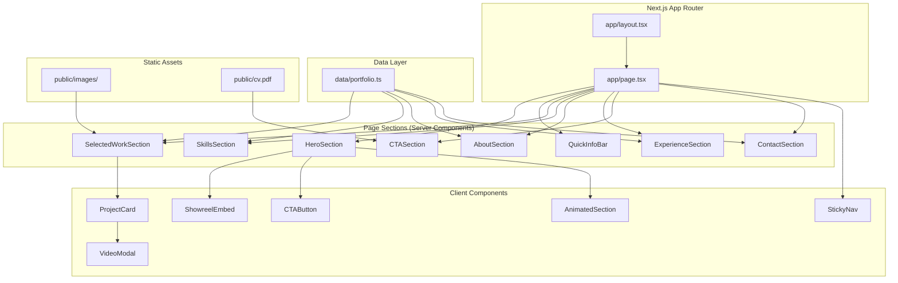

# Design Document: Videographer Portfolio

## Overview

A single-page portfolio website for a junior videographer in Johannesburg, built as a Next.js App Router application. The site uses a dark cinematic design theme to convey professionalism and is structured as 8 distinct sections flowing vertically on a single page. All content is static (no CMS or database), with the primary conversion goal of driving visitors to contact the videographer.

The architecture prioritises:
- **Performance**: Lazy-loaded media, optimised images via `next/image`, deferred iframes
- **Accessibility**: WCAG AA contrast, reduced-motion support, semantic HTML
- **Responsiveness**: Mobile-first design across 3 breakpoint ranges
- **Maintainability**: Component-per-file structure, TypeScript throughout, Tailwind utility classes

### Key Design Decisions

| Decision | Choice | Rationale |
|----------|--------|-----------|
| Content storage | Static TypeScript data files | No backend needed; content changes via code commits |
| Animation library | Framer Motion | Required by requirements; excellent React integration |
| Font | Inter via `next/font/google` | Requirements specify Inter; `next/font` avoids layout shift |
| Component directory | `components/` (top-level) | Keeps `app/` focused on routing; cleaner imports via `@/components` |
| Video modal | Custom lightweight modal | Avoids heavy dialog library for a single use case |
| Sticky navigation | Client Component with scroll listener | Appears after hero scrolls out; disappears at contact section |
| Iframe lazy loading | Intersection Observer | Defers YouTube/Vimeo embeds until near viewport per Req 11.3 |

## Architecture



### Rendering Strategy

- **Server Components** (default): All section wrappers render on the server for zero client JS overhead. Static content (headings, text, lists) stays server-rendered.
- **Client Components** (explicit `"use client"`): Used only where interactivity is required — scroll handlers, Framer Motion animations, Intersection Observer for lazy iframes, video modal state, sticky navigation scroll detection.

### Section Flow

The page renders sections in this fixed order:
1. Hero Section (full viewport)
2. Quick Info Bar
3. Selected Work
4. Skills
5. About
6. Experience
7. CTA
8. Contact

## Components and Interfaces

### Component Tree

```
app/
├── layout.tsx          # Root layout: Inter font, dark theme, metadata
├── page.tsx            # Assembles all sections in order
└── globals.css         # Tailwind imports, CSS variables, base styles

components/
├── HeroSection.tsx     # Full-viewport hero with showreel + CTAs
├── ShowreelEmbed.tsx   # Client: lazy-loaded iframe with fallback
├── QuickInfoBar.tsx    # Four capability items
├── SelectedWork.tsx    # Grid of project cards
├── ProjectCard.tsx     # Client: thumbnail + click-to-open modal
├── VideoModal.tsx      # Client: overlay video player
├── SkillsSection.tsx   # Two-column skill categories
├── AboutSection.tsx    # Bio paragraph
├── ExperienceSection.tsx # Role list
├── CTASection.tsx      # Hiring prompt + action buttons
├── ContactSection.tsx  # Contact details + links
├── StickyNav.tsx       # Client: appears on scroll past hero
├── AnimatedSection.tsx # Client: Framer Motion scroll-triggered wrapper
└── CTAButton.tsx       # Reusable styled button (link or action)

data/
└── portfolio.ts        # All portfolio content as typed constants
```

### Component Interfaces

```typescript
// components/HeroSection.tsx
// Server Component — renders hero layout, delegates embed to client
interface HeroSectionProps {} // No props; reads from data/portfolio.ts

// components/ShowreelEmbed.tsx ("use client")
interface ShowreelEmbedProps {
  videoUrl: string;       // YouTube/Vimeo embed URL
  title: string;          // Accessible iframe title
}

// components/QuickInfoBar.tsx
interface QuickInfoBarProps {} // Reads from data/portfolio.ts

// components/SelectedWork.tsx
interface SelectedWorkProps {} // Reads from data/portfolio.ts

// components/ProjectCard.tsx ("use client")
interface ProjectCardProps {
  project: Project;       // From data model
  onPlay: (videoUrl: string) => void;
}

// components/VideoModal.tsx ("use client")
interface VideoModalProps {
  videoUrl: string | null;  // null = closed
  onClose: () => void;
}

// components/SkillsSection.tsx
interface SkillsSectionProps {} // Reads from data/portfolio.ts

// components/AboutSection.tsx
interface AboutSectionProps {} // Reads from data/portfolio.ts

// components/ExperienceSection.tsx
interface ExperienceSectionProps {} // Reads from data/portfolio.ts

// components/CTASection.tsx
interface CTASectionProps {} // Reads from data/portfolio.ts

// components/ContactSection.tsx
interface ContactSectionProps {} // Reads from data/portfolio.ts

// components/StickyNav.tsx ("use client")
interface StickyNavProps {} // Self-contained scroll logic

// components/AnimatedSection.tsx ("use client")
interface AnimatedSectionProps {
  children: React.ReactNode;
  className?: string;
  delay?: number;         // Animation delay in seconds (0–0.3)
}

// components/CTAButton.tsx
interface CTAButtonProps {
  label: string;
  href?: string;          // If provided, renders as <a>
  onClick?: () => void;   // If provided, renders as <button>
  variant: "primary" | "secondary";
  download?: boolean;     // For CV download button
}
```

### AnimatedSection Behaviour

The `AnimatedSection` wrapper uses Framer Motion's `useInView` hook:
- Triggers once when element enters viewport
- Animates from `opacity: 0, y: 20` to `opacity: 1, y: 0`
- Duration: 500ms (within the 300–700ms requirement)
- Respects `prefers-reduced-motion`: if enabled, renders children immediately with no animation

```typescript
// Pseudocode for AnimatedSection
"use client";
import { motion, useReducedMotion } from "framer-motion";

export function AnimatedSection({ children, className, delay = 0 }: AnimatedSectionProps) {
  const shouldReduceMotion = useReducedMotion();

  if (shouldReduceMotion) {
    return <div className={className}>{children}</div>;
  }

  return (
    <motion.div
      initial={{ opacity: 0, y: 20 }}
      whileInView={{ opacity: 1, y: 0 }}
      viewport={{ once: true, margin: "-100px" }}
      transition={{ duration: 0.5, delay }}
      className={className}
    >
      {children}
    </motion.div>
  );
}
```

### StickyNav Behaviour

- Uses a scroll event listener to detect when the Hero Section's bottom edge passes above the viewport
- Also detects when the Contact Section enters the viewport
- Visible state: after hero scrolls out AND before contact section is reached
- Contains a single "Contact" link that smooth-scrolls to `#contact`
- Renders as a fixed bar at the top of the viewport with the dark theme background

### VideoModal Behaviour

- Rendered at the page level (inside `SelectedWork` parent client component)
- Opens when a `ProjectCard` thumbnail is clicked
- Displays a responsive 16:9 iframe inside a dark overlay
- Closes on: overlay click, Escape key, or close button
- Traps focus within modal while open (accessibility)
- Prevents body scroll while open

## Data Models

```typescript
// data/portfolio.ts

export interface Project {
  id: string;
  title: string;            // max 60 characters
  role: string;             // e.g. "Camera Assistant", "Editor"
  description: string;      // max 120 characters
  thumbnailSrc: string;     // path in /public/images/
  thumbnailAlt: string;     // accessible alt text
  videoUrl: string;         // YouTube/Vimeo embed URL
}

export interface SkillCategory {
  heading: string;          // "Production" or "Post-production"
  skills: string[];
}

export interface ExperienceRole {
  title: string;            // Single-line role description
}

export interface ContactInfo {
  email: string;
  phone: string | null;     // null if phone display disabled
  instagramUrl: string;
  location: string;
}

export interface PortfolioData {
  name: string;                 // Placeholder: "[Full Name]"
  role: string;                 // "Videographer · Video Editor · Camera Assistant"
  location: string;             // "Johannesburg, South Africa"
  tagline: string;
  showreelUrl: string;          // YouTube/Vimeo embed URL
  quickInfoItems: string[];     // Exactly 4 items
  projects: Project[];          // 3–6 items
  skillCategories: SkillCategory[];  // Exactly 2 categories
  bio: string;                  // 50–150 words
  experience: ExperienceRole[];
  ctaText: string;
  ctaEmailSubject: string;      // "Opportunity: [role context]"
  cvFilePath: string;           // "/cv.pdf"
  contact: ContactInfo;
}

// Singleton export
export const portfolioData: PortfolioData = {
  name: "[Full Name]",
  role: "Videographer · Video Editor · Camera Assistant",
  location: "Johannesburg, South Africa",
  tagline: "Crafting clean, story-driven visuals for brands, events, and digital content.",
  showreelUrl: "https://www.youtube.com/embed/placeholder",
  quickInfoItems: [
    "On-set production experience",
    "Video editing (Premiere Pro / DaVinci Resolve)",
    "Camera operation",
    "Available for freelance / junior roles",
  ],
  projects: [], // To be populated with 3–6 project entries
  skillCategories: [
    {
      heading: "Production",
      skills: ["Camera operation", "On-set assisting", "Lighting basics"],
    },
    {
      heading: "Post-production",
      skills: [
        "Adobe Premiere Pro",
        "DaVinci Resolve",
        "Social media editing (Reels, TikTok, Shorts)",
        "Basic colour correction",
      ],
    },
  ],
  bio: "", // 50–150 word professional bio placeholder
  experience: [
    { title: "Production Assistant (freelance / student projects)" },
    { title: "Camera Assistant" },
    { title: "Video Editor (short-form content)" },
  ],
  ctaText:
    "I am currently available for junior production roles, freelance work, and assistant positions in Johannesburg.",
  ctaEmailSubject: "Opportunity: Junior Production Role",
  cvFilePath: "/cv.pdf",
  contact: {
    email: "placeholder@email.com",
    phone: null,
    instagramUrl: "https://instagram.com/placeholder",
    location: "Johannesburg, South Africa",
  },
};
```

## Error Handling

| Scenario | Handling Strategy |
|----------|-------------------|
| Showreel iframe fails to load | `ShowreelEmbed` uses `onError` event on iframe; renders fallback div with "Showreel coming soon" text (Req 1.10) |
| Project video unavailable | `ProjectCard` checks `videoUrl` validity; if empty/null, displays thumbnail with a "Video unavailable" badge overlay and disables click-to-play (Req 3.5) |
| CV file download fails | `CTAButton` with `download` variant uses a try-catch on fetch; on failure, displays inline error text "File could not be retrieved" below the button, button remains clickable for retry (Req 7.5) |
| Image load failure | `next/image` provides built-in error handling; fallback to a dark placeholder with icon |
| Instagram/email link invalid | Links are static configuration; validated at build time via TypeScript types |
| Reduced motion preference | `AnimatedSection` detects via `useReducedMotion()` and skips all animations (Req 9.5) |

### Iframe Load Detection

The `ShowreelEmbed` component uses a combination approach:
1. Sets a timeout (5 seconds) after mount
2. Listens for the iframe `load` event to cancel the timeout
3. If timeout fires before `load`, switches to fallback state
4. Provides a "Retry" action to re-attempt loading

## Testing Strategy

### Why Property-Based Testing Does Not Apply

This feature is a **UI rendering and layout** project. It consists of:
- Static content display with no data transformations
- Responsive CSS layouts
- Framer Motion animations (visual)
- Simple click handlers (scroll, open modal, open email client)

There is no algorithmic logic, no parsing/serialization, no complex state machines, and no meaningful input space that varies. PBT is designed for functions where behaviour varies meaningfully with input — none of the acceptance criteria involve such logic. Therefore, **the Correctness Properties section is omitted**.

### Testing Approach

**Unit Tests (Vitest + React Testing Library)**:
- Verify each section component renders expected content (headings, text, links)
- Verify `CTAButton` renders correct element (`<a>` vs `<button>`) based on props
- Verify `ProjectCard` displays all required fields (title, role, description, thumbnail)
- Verify `VideoModal` opens/closes correctly, traps focus
- Verify `ShowreelEmbed` displays fallback when iframe load fails
- Verify reduced-motion behaviour in `AnimatedSection`
- Verify `StickyNav` visibility logic (visible after hero, hidden at contact)
- Verify responsive class application at different breakpoints (using container queries or manual class checks)

**Integration Tests (Playwright or Cypress)**:
- Full page load and scroll through all sections
- Click "View Showreel" → page scrolls to showreel embed
- Click "Contact" → page scrolls to contact section
- Click project card → modal opens with video
- Sticky nav appears after scrolling past hero
- Sticky nav "Contact" link scrolls to contact section
- "Email me" button opens mailto link
- "Download CV" initiates file download
- Mobile viewport: all sections single-column, tap targets ≥ 44px

**Accessibility Tests**:
- axe-core integration for WCAG AA compliance
- Contrast ratio validation on dark theme (4.5:1 body, 3:1 large text)
- Keyboard navigation through all interactive elements
- Screen reader testing for semantic structure

**Performance Tests (Lighthouse CI)**:
- LCP < 2s on simulated 4G
- Initial transfer < 500 KB compressed
- No iframe in initial HTML payload
- Images use `next/image` with proper loading attributes

### Test Configuration

- **Framework**: Vitest (unit) + Playwright (e2e)
- **Coverage target**: All components have at least one render test
- **CI integration**: Run on every PR via GitHub Actions
